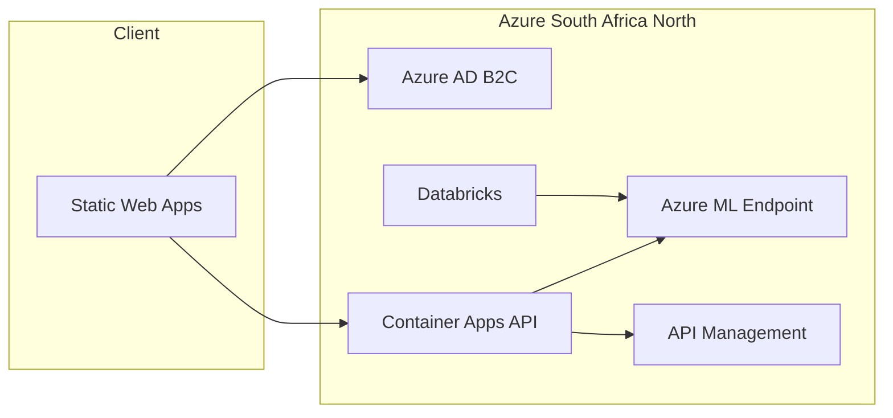

# AfricaGuard

**AfricaGuard** is a national-scale cybersecurity and sales intelligence platform for Southern Africa. It extends the **CyberNova Insight Engine** (CET333) with Azure-ready deployment: Container Apps, Static Web Apps, Azure ML, Azure AD B2C, and Claude AI threat explanations.

> **Author:** Reneilwe Keoagile (BIDA22-061) · Botswana Accountancy College · CRISP-DM  
> **Repository:** [https://github.com/ReneilweKeoagile061/CyberNova-Insight-Engine](https://github.com/ReneilweKeoagile061/CyberNova-Insight-Engine) (public)

---

## What changed (CyberNova → AfricaGuard v3.0)

This release migrates the CET333 stack from a local demo to a production-shaped Azure platform. **Nothing was removed** — features were extended.

### Rebrand & project

| Area | Before | After |
|------|--------|-------|
| Product name | CyberNova Insight Engine | **AfricaGuard** |
| npm package | `databricks-insights-dashboard` | `africaguard` |
| API version | 2.0.1 | **3.0.0-AFRICAGUARD** |
| Demo emails | `@cybernova.ai` | `@africaguard.ai` (legacy `@cybernova.ai` still works) |
| Demo passwords | `CyberNovaSales2026` / `CyberNovaSecurity2026` | `AfricaGuardSales2026` / `AfricaGuardSecurity2026` |

### New backend files (`submission_package/`)

| File | Purpose |
|------|---------|
| `azure_ml.py` | Calls Azure ML online endpoint; **falls back** to local `rf_model.pkl` if Azure is unavailable |
| `africaguard_auth.py` | Dual auth: Flask **sessions** (local) or **Azure AD B2C JWT** (production) |
| `retrain_model.py` | Retrains Random Forest; optionally registers model to Azure ML + uploads `scaler.pkl` to Blob |
| `Dockerfile` | Container image for Azure Container Apps (gunicorn) |
| `.dockerignore` | Keeps image size small |

### API changes (`app.py`)

- `/api/predict` — returns `inference_source`: `azure_ml`, `local_pkl`, or `local_fallback`
- `/api/explain-threat` — Claude AI summaries (executive / technical / analyst audiences)
- `/api/health` — reports `auth_mode` and `model_source`
- `AUTH_MODE` env: `session` (default) or `b2c`
- CORS configurable via `CORS_ORIGINS`

### New frontend files

| File | Purpose |
|------|---------|
| `src/auth/msalConfig.js` | Azure AD B2C MSAL configuration |
| `AuthContext.jsx` | Session login **or** MSAL (`VITE_USE_B2C_AUTH`) |
| `api.js` | Bearer tokens for B2C; `explainThreat()` for Claude UI |
| `ThreatIntelligence.jsx` | **Explain** button per threat row |
| `Login.jsx` | Email/password (local) or “Sign in with Microsoft” (B2C) |

### DevOps & docs

| File | Purpose |
|------|---------|
| `.env.azure` | Production environment template |
| `.env.example` | Local frontend defaults |
| `DEPLOYMENT.md` | Condensed Azure CLI checklist |
| `staticwebapp.config.json` | SPA routing for Azure Static Web Apps |
| `.github/workflows/azure-static-web-apps.yml` | CI/CD on push to `main` |

### Dependencies added

**Python:** `requests`, `PyJWT`, `gunicorn`, `azure-ai-ml`, `azure-identity`, `azure-storage-blob`, `mlflow`, `anthropic` (optional Azure/Claude packages)

**npm:** `@azure/msal-browser`, `@azure/msal-react`

---

## Features

| Module | Roles | Description |
|--------|-------|-------------|
| Main Dashboard | Sales, Security | KPIs, trends, confusion matrix, feature importance |
| Regional Demand | Sales | Regional demand views |
| Campaign Performance | Sales | Campaign metrics |
| Threat Intelligence | Security | Top IPs + **Claude Explain** |
| ML Predictions | Sales, Security | Random Forest (local or Azure ML) |

---

## Quick start (local — no Azure required)

### 1. Backend

```powershell
cd submission_package
pip install Flask flask-cors pandas numpy scikit-learn requests PyJWT --no-cache-dir
python app.py
```

Health: [http://localhost:5000/api/health](http://localhost:5000/api/health)

> If `pip install -r requirements.txt` fails with **disk full**, install only the packages above, or free space and retry with `--no-cache-dir`.

### 2. Frontend

```powershell
cd "C:\Users\bida22-061\Desktop\Product Dev Databricks"
npm install
copy .env.example .env
npm run dev
```

Open [http://localhost:3000](http://localhost:3000)

### 3. Demo login (session mode — default)

| Role | Email | Password |
|------|-------|----------|
| Sales | `sales@africaguard.ai` | `AfricaGuardSales2026` |
| Security | `security@africaguard.ai` | `AfricaGuardSecurity2026` |

---

## How to enable all Azure features

Use this order. Each phase can be tested before moving on. Full CLI commands are in **[DEPLOYMENT.md](./DEPLOYMENT.md)**.

### Prerequisites

```bash
winget install Microsoft.AzureCLI
az login
az group create --name rg-africaguard-prod --location southafricanorth
```

Copy **[.env.azure](./.env.azure)** and fill in your subscription ID, keys, and URLs.

---

### Phase 1 — Azure Databricks + Azure ML (model registry)

**Enable:** Model training in the cloud and versioned artifacts.

```bash
az databricks workspace create --name dbw-africaguard --resource-group rg-africaguard-prod --location southafricanorth --sku standard
az ml workspace create --name mlw-africaguard --resource-group rg-africaguard-prod --location southafricanorth
```

**Set in `submission_package/` environment:**

```env
AZURE_SUBSCRIPTION_ID=your-subscription-id
AZURE_RESOURCE_GROUP=rg-africaguard-prod
AZURE_ML_WORKSPACE=mlw-africaguard
AZURE_STORAGE_CONNECTION_STRING=your-blob-connection-string
```

**Run:**

```bash
cd submission_package
pip install azure-ai-ml azure-identity azure-storage-blob mlflow
python retrain_model.py
```

**Verify:** Azure ML Studio → **Models** → `africaguard-rf-classifier`; Blob container `model-artifacts` → `scaler.pkl`.

---

### Phase 2 — Azure ML online endpoint (managed inference)

**Enable:** `/api/predict` uses Azure ML instead of local `.pkl` only.

```bash
az ml online-endpoint create --name africaguard-endpoint --resource-group rg-africaguard-prod --workspace-name mlw-africaguard
az ml online-deployment create --name blue --endpoint-name africaguard-endpoint --model azureml:africaguard-rf-classifier:1 --instance-type Standard_DS2_v2 --instance-count 1 --resource-group rg-africaguard-prod --workspace-name mlw-africaguard
```

**Set on API:**

```env
AZURE_ML_ENDPOINT_URL=https://africaguard-endpoint.southafricanorth.inference.ml.azure.com/score
AZURE_ML_ENDPOINT_KEY=<from Azure ML Studio → Endpoints → Keys>
```

**Verify:** POST `/api/predict` → response includes `"inference_source": "azure_ml"`. Remove the key temporarily to confirm `local_fallback`.

---

### Phase 3 — Azure Container Apps (Flask API in production)

**Enable:** Public HTTPS API with auto-scaling.

```bash
cd submission_package
az acr create --name africaguardacr --resource-group rg-africaguard-prod --sku Basic --admin-enabled true
az acr login --name africaguardacr
docker build -t africaguardacr.azurecr.io/africaguard-api:v1 .
docker push africaguardacr.azurecr.io/africaguard-api:v1
az containerapp env create --name env-africaguard --resource-group rg-africaguard-prod --location southafricanorth
# az containerapp create ... (see DEPLOYMENT.md)
```

**Set secrets:** `FLASK_SECRET_KEY`, `ABUSEIPDB_API_KEY`, `AZURE_ML_ENDPOINT_*`, `ANTHROPIC_API_KEY`

**Frontend:**

```env
VITE_API_BASE_URL=https://africaguard-api.<your-id>.southafricanorth.azurecontainerapps.io/api
```

**Verify:** `GET .../api/health` returns healthy JSON from the Azure URL.

---

### Phase 4 — Azure AD B2C (enterprise SSO + MFA)

**Enable:** Replace demo email/password with Microsoft login and JWT on the API.

1. Azure Portal → **Azure AD B2C** → tenant `africaguard`
2. User groups: `AfricaGuard_Sales`, `AfricaGuard_Security`
3. App registration → note **Client ID**; redirect URI: `https://<your-static-app>/auth/callback`

**Backend (`submission_package` / Container App):**

```env
AUTH_MODE=b2c
AZURE_B2C_TENANT=africaguard
AZURE_B2C_CLIENT_ID=<client-id>
VERIFY_B2C_SIGNATURE=false
```

**Frontend (`.env` or Static Web App settings):**

```env
VITE_USE_B2C_AUTH=true
VITE_B2C_CLIENT_ID=<client-id>
VITE_B2C_TENANT=africaguard
VITE_B2C_POLICY=B2C_1_signin
VITE_REDIRECT_URI=https://<your-static-app>.azurestaticapps.net/auth/callback
```

**Verify:** Login redirects to B2C; Sales vs Security tabs match group membership; API returns 401 without Bearer token.

---

### Phase 5 — Azure Static Web Apps (React CDN + CI/CD)

**Enable:** Global dashboard hosting and deploy on every `git push` to `main`.

```bash
az staticwebapp create --name africaguard-dashboard --resource-group rg-africaguard-prod --location "East US 2" --sku Free --source https://github.com/ReneilweKeoagile061/CyberNova-Insight-Engine --branch main --app-location "/" --output-location "dist" --login-with-github
```

**GitHub repo → Settings → Secrets:**

| Secret | Value |
|--------|--------|
| `AZURE_STATIC_WEB_APPS_API_TOKEN` | From Azure Static Web App deployment token |
| `VITE_API_BASE_URL` | Container App API URL |
| `VITE_USE_B2C_AUTH` | `true` when B2C is ready |
| `VITE_B2C_CLIENT_ID` | B2C app client ID |

**Verify:** Push to `main` triggers workflow; site loads from `*.azurestaticapps.net`.

---

### Phase 6 — Claude AI + Azure API Management

**Enable:** Natural-language threat explanations and cached external APIs.

**Claude — set on API:**

```env
ANTHROPIC_API_KEY=your-claude-api-key
ANTHROPIC_MODEL=claude-sonnet-4-20250514
```

**Verify:** Threat Intelligence → **Explain** on a row; `/api/explain-threat` returns text (demo fallback if key is missing).

**API Management:**

```bash
az apim create --name apim-africaguard --resource-group rg-africaguard-prod --publisher-name "AfricaGuard" --publisher-email "your@email.com" --sku-name Consumption
```

Import Container App as backend; add cache + rate-limit policies on `/scan-ip` (see migration guide / DEPLOYMENT.md).

---

## Environment variables — complete reference

### Backend (`submission_package/` or Container Apps)

| Variable | Local default | Azure production |
|----------|---------------|------------------|
| `AUTH_MODE` | `session` | `b2c` |
| `FLASK_SECRET_KEY` | auto demo key | strong secret |
| `AFRICAGUARD_CACHE_TTL` | `45` | `45` |
| `AZURE_ML_ENDPOINT_URL` | *(empty = local pkl)* | endpoint score URL |
| `AZURE_ML_ENDPOINT_KEY` | *(empty)* | endpoint key |
| `AZURE_SUBSCRIPTION_ID` | *(empty)* | subscription GUID |
| `AZURE_RESOURCE_GROUP` | `rg-africaguard-prod` | same |
| `AZURE_ML_WORKSPACE` | `mlw-africaguard` | same |
| `AZURE_STORAGE_CONNECTION_STRING` | *(empty)* | blob connection |
| `AZURE_B2C_TENANT` | `africaguard` | B2C tenant name |
| `AZURE_B2C_CLIENT_ID` | *(empty)* | app registration ID |
| `ANTHROPIC_API_KEY` | *(empty = demo text)* | Claude API key |
| `ABUSEIPDB_API_KEY` | *(optional)* | AbuseIPDB key |
| `CORS_ORIGINS` | `localhost:3000` | Static Web App URL |

### Frontend (project root `.env`)

| Variable | Local | Production |
|----------|-------|------------|
| `VITE_API_BASE_URL` | `http://localhost:5000/api` | Container Apps `/api` URL |
| `VITE_USE_B2C_AUTH` | `false` | `true` |
| `VITE_B2C_CLIENT_ID` | *(empty)* | B2C client ID |
| `VITE_B2C_TENANT` | `africaguard` | tenant name |
| `VITE_REDIRECT_URI` | `http://localhost:3000/auth/callback` | Static Web App callback |
| `VITE_APP_NAME` | `AfricaGuard` | `AfricaGuard` |

---

## Project structure

```
AfricaGuard/
├── src/
│   ├── auth/msalConfig.js
│   ├── components/          # Dashboard, Threats, Login, …
│   ├── contexts/AuthContext.jsx
│   └── services/api.js
├── submission_package/
│   ├── app.py
│   ├── azure_ml.py
│   ├── africaguard_auth.py
│   ├── retrain_model.py
│   ├── Dockerfile
│   └── cybernova_sample_data.csv
├── .env.azure
├── .env.example
├── staticwebapp.config.json
├── DEPLOYMENT.md
└── .github/workflows/
```

---

## Architecture



---

## Estimated Azure monthly cost

| Service | Est. cost (demo) |
|---------|------------------|
| Static Web Apps (Free) | $0 |
| Azure AD B2C (50k MAU free) | $0 |
| Container Apps (scale to 0) | $0–10 |
| Azure ML + Databricks (on demand) | $15–45 |
| API Management (Consumption) | $0–5 |
| **Total (portfolio demo)** | **~$0–65/month** |

---

## Make this repository public

1. Open [github.com/ReneilweKeoagile061/CyberNova-Insight-Engine](https://github.com/ReneilweKeoagile061/CyberNova-Insight-Engine)
2. **Settings** → **General** → **Danger Zone** → **Change repository visibility** → **Public**

---

## Scripts

| Command | Description |
|---------|-------------|
| `npm run dev` | Vite dev server (port 3000) |
| `npm run build` | Production build → `dist/` |
| `python app.py` | Flask API (port 5000) |
| `python retrain_model.py` | Retrain + optional Azure ML register |

---

## License

CET333 academic project — educational and demonstration use.

*AfricaGuard v3.0 · Built on CyberNova Insight Engine · Reneilwe Keoagile · BIDA22-061*
